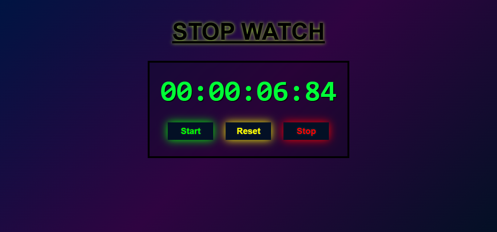

# ⏱️ Stop Watch

A sleek, full-featured **web stop watch** built with plain HTML, CSS, and vanilla JavaScript. It displays hours, minutes, seconds, and centiseconds, and supports **Start**, **Stop**, and **Reset** controls.

---

## 🔍 Description

This Stop Watch web app allows users to:

- Start timing
- Pause and resume
- Reset to zero

It showcases precise timekeeping by updating centiseconds and offers an eye-catching, neon-inspired UI with smooth CSS animations.

---

## ✨ Features

- Records elapsed time in **HH:MM:SS:CS** format (hours, minutes, seconds, centiseconds)
- **Start**, **Stop**, and **Reset** controls  
- Accurate timing using `Date.now()` and `setInterval()`  
- Responsive, neon-style interface with CSS visual effects

---

## 🛠️ Built With

- **HTML5** – Semantic structure  
- **CSS3** – Centered layout, gradient background, and button glow effects  
- **JavaScript (Vanilla)** – Core timing logic and UI updates

---

## 📸 Screenshots

  

---
