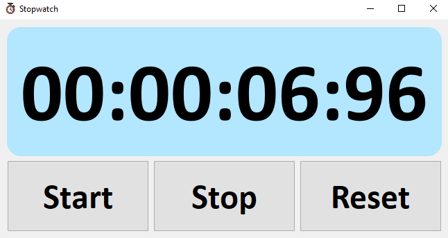

# 🕒 PyQt5 Stopwatch

A simple yet elegant stopwatch application built using **PyQt5** in Python. The stopwatch features start, stop, and reset functionalities, with a clean and modern GUI.

## 🧰 Features

- Millisecond-accurate stopwatch
- Responsive UI built with PyQt5
- Modern design with styled labels and buttons
- Clean and readable code structure

## 📝 Code Overview

- **`QTimer`** updates the stopwatch every 10 milliseconds.
- **`QTime`** is used to track elapsed time.
- Buttons: **Start**, **Stop**, and **Reset** trigger connected functions.
- UI is styled using PyQt5's **QSS (Qt Style Sheets)**.

## 🚀 Getting Started
### ✅ Prerequisites

Make sure you have Python 3 and PyQt5 installed.

Install PyQt5 using pip:

```bash
pip install PyQt5
```

## 📁 Project Structure
```
Stop_Watch_2/
│
├── Stop Watch.py          # Main application file
├── stopwatch_icon.png     # Icon used in the app
└── README.md              # Project documentation

```

---

## 📸 Screenshots

<p float="left">
  
</p>

---
